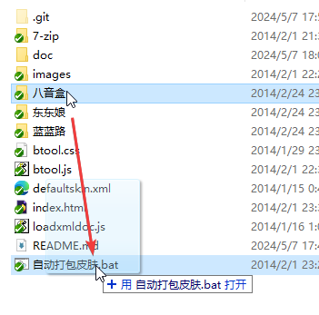

# 必应输入法皮肤模拟器
2014年应该是 [@程序员邹欣](https://blog.csdn.net/csdnnews/article/details/112915663) 主持 *必应输入法* 开发期间。

我“代表”[动漫东东](http://bbs.comicdd.com/)论坛参加了必应输入法的皮肤大赛。感觉当时必应输入法的皮肤理念还是挺先进的，可以用APNG来实现动画。为了方便制作皮肤时的开发调试，我做了这个工具来快速预览皮肤样式。

2014年的时候 ES6 还没有现在这么普遍，我基于我自学的知识写出来的这个工具。

> 目前微软官方对于必应输入法的支持请见：
> [对 Windows 中的必应 IME 支持已终止](https://support.microsoft.com/zh-cn/topic/%E5%AF%B9-windows-%E4%B8%AD%E7%9A%84%E5%BF%85%E5%BA%94-ime-%E6%94%AF%E6%8C%81%E5%B7%B2%E7%BB%88%E6%AD%A2-4ac4ac29-1959-54c8-08cf-a97dc210bab6)

## 预览
这是我做的3个皮肤
1. 作品名：快要坏掉的八音盒，画师：[POP](https://www.pixiv.net/users/41477)，未取得艺术品版权。我特别喜欢 POP 的画风，这才叫“萌”。  
   
1. 作品名：蓝蓝路，版权：日本金拱门，未取得艺术品版权  
   
1. 作品名：东东娘，画师：[枫谷剑仙](https://www.pixiv.net/users/3896348)，我的东东娘二创，形象原设计是[C様](https://weibo.com/u/1723480193)
   

## 用法
### 皮肤模拟
因为 2014 年的浏览器权限和现在的不一样，所以当时没现在这么麻烦必须用 http 服务器，直接运行`index.html`就行。

在某个文件夹里编辑输入法的各种基础文件。  

网页里，文件夹路径输入这个文件夹的名字，点击获取皮肤。  
毕竟是我 10 年前写的了，不知道为什么，图片需要点两次才出来。  

### 自动打包
把文件夹拖到自动打包 bat 上就能自动打包了。  
